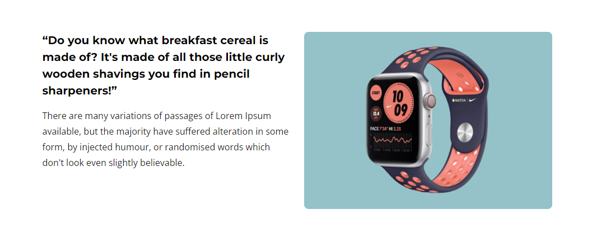
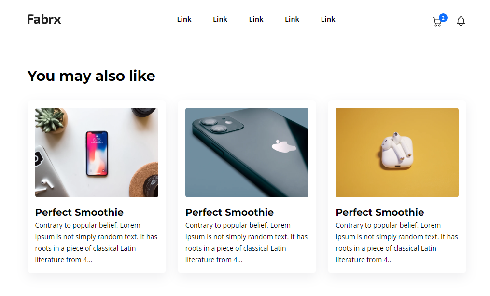

# fabrixBlogSite
HTML-CSS 

Hi,

In this project, I designed and developed a blog site using my frontend skills. I created the UI using HTML, CSS and paid attention to responsive design principles.

 

